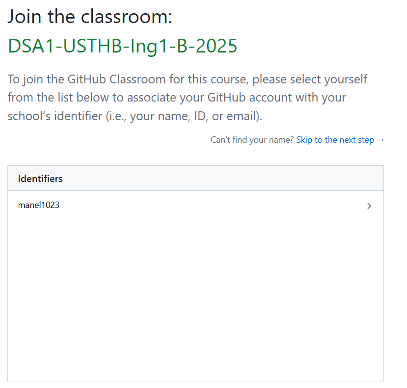
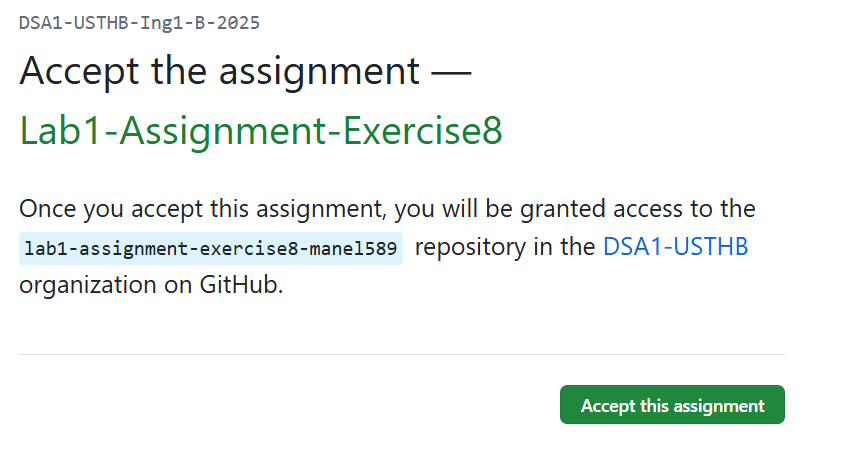
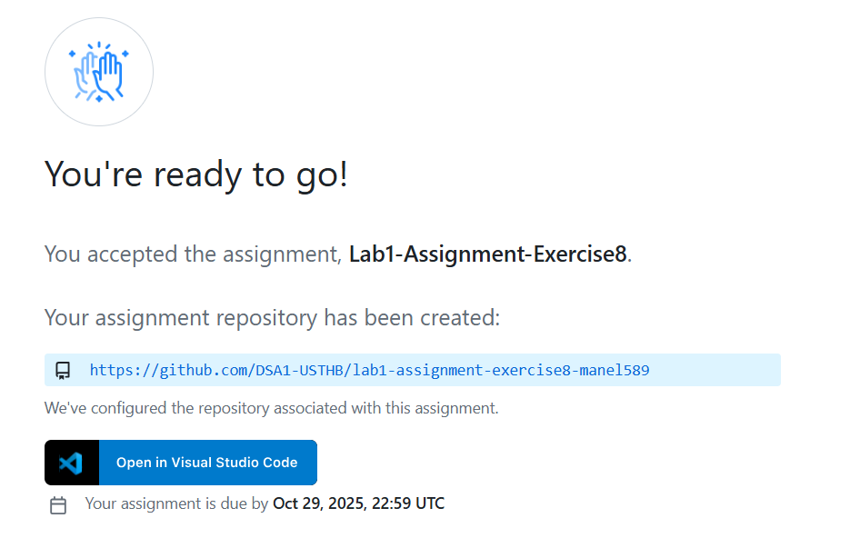

# 🌱 Git & GitHub: Your Lab Companion

Welcome to your complete guide for using **Git** and **GitHub** in the DSA 1 Lab!  
This guide will walk you through everything from installation to submitting your assignments with confidence.

---

## 🧠 What Are Git and GitHub?

| Tool | Role in Your Lab Work |
|------|----------------------|
| **Git** | Your **local time machine** - tracks every change you make to your code files on your computer |
| **GitHub** | Your **online submission folder** - stores your code in the cloud and lets instructors see your work |

Think of Git as your personal notebook, and GitHub as the teacher's mailbox where you submit assignments.

---

## ⚙️ Step 1: Install Git

### 🪟 On Windows

1. Download from [git-scm.com](https://git-scm.com/)
2. Run the installer → Keep all default options
3. Choose "Visual Studio Code" as default editor if prompted
4. Complete installation

### 🍎 On macOS

```bash
xcode-select --install
```

Or using Homebrew:

```bash
brew install git
```

### 🐧 On Linux

```bash
sudo apt update && sudo apt install git
```

**Verify installation:**

```bash
git --version
```

## 🔧 Step 2: Configure Git (One-Time Setup)

```bash
git config --global user.name "Your Full Name"
git config --global user.email "your-email@usthb.dz"
```

This connects your work to your identity - like writing your name on your lab copies.

---

## 🚀 How to Complete and Submit Assignments

### 📥 Step 3: Get Your Assignment Repository

1. **Click the GitHub Classroom link** provided for each lab
2. **Select your identifier from the roster list**
   
3. **Accept the assignment** - GitHub creates your private repository
   
4. **Clone it to your computer:**
   

   ```bash
   git clone https://github.com/USTHB-DSA1/lab1-yourusername.git
   cd lab1-yourusername
   ```

### 💻 Step 4: Work on Your Code

1. **Open the folder** in VS Code or your preferred editor
2. **Write and test your C programs** locally
3. **Save your files** regularly

### 📤 Step 5: Submit Your Work

When you've completed an exercise (or want to save progress):

```bash
# Step 1: Add all changed files to "staging area"
git add .

# Step 2: Save your changes with a descriptive message
git commit -m "Completed exercise 1: Fibonacci sequence"

# Step 3: Upload to GitHub (submit your work)
git push origin main
```

**💡 Pro Tip:** You can push multiple times! Each push updates your submission.

---

## 🎯 Complete Assignment Workflow Example

Let's walk through **Lab 1 - Exercise 8**:

```bash
# 1. Get your assignment (using the URL from Step 3)
git clone https://github.com/DSA1-USTHB/lab1-assignment-exercise8-manel589.git
cd lab1-assignment-exercise8-manel589

# 2. Write code in main.c, test it locally
gcc main.c -o program
./program

# 3. When exercise is working, submit it
git add .
git commit -m "Solved exercise 8: Hello World program"
git push origin main

# 4. Continue with next exercise...
# Edit main.c for exercise 2
git add .
git commit -m "Completed exercise 2: Calculator functions"  
git push origin main
```

---

## 🔄 Keeping Your Work Updated

If the instructor adds new materials or corrections:

```bash
# Get the latest updates
git pull origin main
```

Always do this **before starting a new work session**.

---

## 🌐 Alternative: GitHub Web Editor

**For quick fixes or emergencies**, you can edit directly on GitHub:

1. Go to your repository on GitHub.com
2. Click on any `.c` file → **Edit** (pencil icon)
3. Make changes → Scroll down → **Commit changes**
4. Add a message → Click **Commit**

⚠️ **Warning:** You can't compile or test code this way - use only for small edits!

---

## 🛠️ Essential Git Commands Cheat Sheet

| Command | When to Use It | Example |
|---------|---------------|---------|
| `git status` | Check what files you've changed | `git status` |
| `git add .` | Stage all changes for commit | `git add .` |
| `git add file.c` | Stage specific file only | `git add main.c` |
| `git commit -m "msg"` | Save changes with description | `git commit -m "Fixed bug"` |
| `git push` | Upload to GitHub | `git push` |
| `git pull` | Download updates | `git pull` |
| `git log` | See your commit history | `git log` |

---

## 🎓 Best Practices for Lab Success

### ✅ Do:"

- **Commit after each working exercise**
- **Write clear commit messages**: "Added factorial function" not "fixed stuff"
- **Test your code** before pushing
- **Pull updates** before starting work
- **Push regularly** - don't wait until deadline

### ❌ Don't:"

- Edit files directly on GitHub (except small fixes)
- Forget to compile and test locally
- Use vague commit messages
- Wait until the last minute to push

---

## 🆘 Troubleshooting Common Issues

| Problem | Solution |
|---------|----------|
| `git push` asks for password | Use [GitHub Personal Access Token](https://docs.github.com/en/authentication) |
| `git pull` has conflicts | Contact instructor - don't try to resolve complex conflicts alone |
| Can't clone repository | Check your internet and the repository URL |
| Files not showing on GitHub | Make sure you did `git add` and `git push` |

---

## 📝 Submission Checklist

Before each lab deadline, verify:

- ☐ All exercises are committed with clear messages
- ☐ Code compiles without errors
- ☐ Final version is pushed to GitHub
- ☐ You can see your code on GitHub.com
- ☐ All required files are present

---

## 🎉 You're Ready!"

You now have everything needed to manage and submit your lab work efficiently. Remember: **commit often, push regularly, and test always**.

**Next:** Start with [Lab 1: Basic C Concepts](lab1/lab1.md) and apply your new Git skills!

---

> *Prepared and maintained by **Maria Djadi**  
> Department of Computer Science, USTHB  
> ✉️ [maria.djadi@etu.usthb.dz](mailto:maria.djadi@etu.usthb.dz) | 🔗 [LinkedIn](https://www.linkedin.com/in/maria-djadi)*
