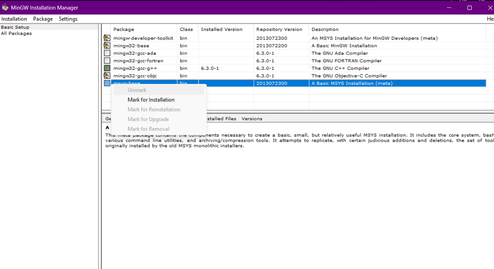
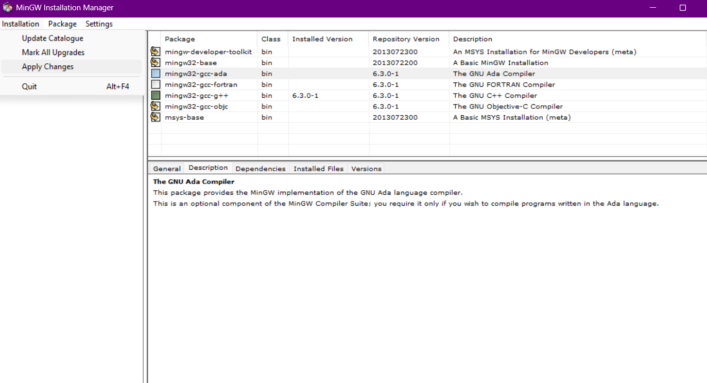
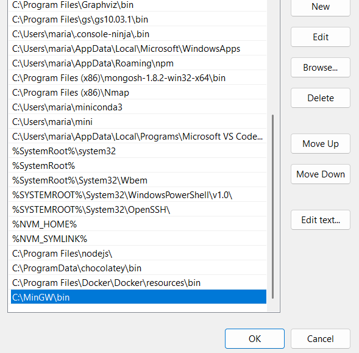

# ⚙️ Environment Setup Guide

Welcome to your **first step in the DSA 1 adventure! 🚀**  
Before diving into coding and solving real problems, let’s prepare your machine for success.

This setup guide will walk you through everything you need to start programming in **C**, from installing your compiler to testing your very first “Hello World” program.

---

## 🧩 1. What Is a Compiler?

A **compiler** is like a translator 🗣️ — it converts the code you write (in C language) into something your computer can actually understand and run.

We’ll use **GCC (GNU Compiler Collection)** — one of the most popular and reliable C compilers in the world.

You’ll write your code → compile it with GCC → run your program.  
Simple and powerful.

---

## 💻 2. Installing GCC (Your C Compiler)

### 🔹 On Windows (using MinGW)

1. Go to the [MinGW-w64 Download Page](https://sourceforge.net/projects/mingw/)
2. Download the **installer** (`mingw-get-setup.exe`)
3. Run the installer and follow these steps:
   - Click "Install"
   - Choose installation directory (default `C:\MinGW` is fine)
   - Wait for download and installation
4. **Install Required Packages:**
   - Open **MinGW Installation Manager**
   - In the left panel, select **All Packages → MinGW → MinGW Base System**
   - Right-click and "Mark for Installation" on:
     - `mingw32-base`
     - `mingw32-gcc-g++` 
     - `mingw32-gdb`
   

5. **Apply Changes:**
   - Go to top menu: **Installation → Apply Changes**
   - Click "Apply" and wait for installation to complete
   - Close MinGW Installation Manager


6. **Add to PATH:**
   - Find your MinGW `bin` folder (usually `C:\MinGW\bin`)
   - Search "Environment Variables" in Start menu
   - Click "Environment Variables"
   - Under "System Variables", find "Path", click "Edit"
   - Click "New" and add: `C:\MinGW\bin`
   - Click OK to close all dialogs
   

7. **Verify Installation:**
   - Open **new Command Prompt** (important: restart if already open)
   - Type:

   ```bash
   gcc --version
   ```

✅ You should see version information — congratulations, GCC is ready!

### 🔹 On macOS

Just open Terminal and type:

```bash
xcode-select --install
```

This installs Apple’s developer tools, including GCC.
Then verify it:

```bash
gcc --version
```

### 🔹 On Linux (Ubuntu/Debian)

Run this in your terminal:

```bash
sudo apt update
sudo apt install build-essential
```

Then verify:

```bash
gcc --version
```

Done! 🎉

## 🧠 3. Choose Your Code Editor

You’ll need a place to write your code — that’s your text editor or IDE (Integrated Development Environment).

Here are your top options:

| Editor        | Description                                                        | Download            |
|---------------|--------------------------------------------------------------------|---------------------|
| VS Code       | Modern, lightweight, with tons of extensions and built-in terminal.| [Download VS Code](https://code.visualstudio.com/) |
| Code::Blocks  | Classic beginner-friendly IDE that comes with a compiler (optional).| [Download Code::Blocks](http://www.codeblocks.org/downloads) |
| CLion (JetBrains) | Professional C/C++ IDE, free for students.                     | [Download CLion](https://www.jetbrains.com/clion/) |
| Dev C++      | Simple and lightweight IDE for Windows.                             | [Download Dev C++](https://sourceforge.net/projects/orwelldevcpp/) |

💡 **Recommended:** VS Code — it’s clean, customizable, and perfect for C beginners.

## 🔍 4. Testing Your Setup

Let’s see if your environment is ready!

1. Open your **editor** or **terminal**.

2. Create a file called `hello.c` and paste this code:

```c
#include <stdio.h>

int main() {
    printf("Hello, DSA 1 Lab!\n");
    return 0;
}
```

3. Save the file, then compile and run it:

```bash
gcc hello.c -o hello
./hello
```

If you see this:

```bash
Hello, DSA 1 Lab!
```

**🎉 You’ve done it!** Your C environment is ready for action.

## 🧰 5. How It All Works (Behind the Scenes)

Here’s a quick breakdown of what just happened:

| Step                       | What It Does                                                  |
|----------------------------|--------------------------------------------------------------|
| `gcc hello.c -o hello`     | Compiles your C file into an executable named `hello`       |
| `./hello`                  | Runs your compiled program                                   |
| `printf()`                 | Displays output text in the terminal                         |
| `return 0;`                | Tells the computer your program ran successfully             |

Understanding this basic flow is key — every C program you’ll write follows this same pattern!

### ⚡ Common Issues & Fixes

| Problem                     | Cause                          | Solution                                        |
|-----------------------------|--------------------------------|-------------------------------------------------|
| 'gcc' is not recognized      | Compiler not added to PATH     | Reinstall MinGW or add bin folder manually      |
| File not found               | Wrong directory                | Use cd to move into your code’s folder         |
| Program doesn’t run          | Missing ./ on Unix/macOS      | Run as ./program_name                           |
| Compilation errors          | Syntax mistakes                | Check your code for typos or missing semicolons |

## 🧩 What’s Next?

Now that your setup is ready, you’re prepared to:

- Learn how to use **Git & GitHub** for your lab submissions.

- Start [Lab 1: Introduction to C](lab1/lab1.md).

Head over to the next page 👉 [Git & GitHub Basics](github-guide.md).

to learn how we’ll collaborate, submit assignments, and track your progress!

---

> *Prepared and maintained by **Maria Djadi***
> Department of Computer Science, USTHB  
> ✉️ [maria.djadi@etu.usthb.dz](mailto:maria.djadi@etu.usthb.dz) | 🔗 [LinkedIn](https://www.linkedin.com/in/maria-djadi)
